# PBT223 API and Demo

 

- [English](README.md)
- [中文](README.zh-CN.md)

* The PBT223 series is a UART programmable DC-DC synchronous buck module.
    - **PBT223-Fixed:** Supports constant voltage (CV) mode only
    - **PBT223-ADJ:** Supports 3 mode: constant voltage (CV), constant power (CP), and 12-bit DAC mode
* **DC/DC Buck Synchronous Step-down Circuit**
    - **Vin = 3.8 – 30 V**
    - **Vout = 0.8 – 22 V (fixed & adjustable output)**
    - **Iout = 0 – 3 A**
    - **Switching frequency:** Default 500kHz, supports 200kHz – 2.2MHz
    - **Maximum duty cycle:** 98%
    - **Soft start time:** Default 4.8ms
* **UART Serial Port for Reading Data:** Read output status, read Vin, Vout, Iout, Pout, temperature sensor values, EEPROM data, etc
* **UART Serial Port for Writing Data:** Turn on/off output, set Vout, Iout, max protection values, EEPROM data, etc

* **OLED Display:** Shows real-time data Vin, Vout, Iout, Pout, temperature sensor values
* **Software and Hardware Protection Circuits:** Input undervoltage protection (UVLO), input/output overvoltage protection (OVP), output overcurrent protection (OCP), output overpower protection (OPP), output short circuit protection, overtemperature protection (OTP), input/output reverse protection, ESD protection
* **Python API & Example Code:** In Python, supports Windows and Linux systems
* **Operating Temperature Range:** -40 - 85 ℃

<table style="width:100%; text-align:center;">
  <tr>
    <td style="width: 50%;">
      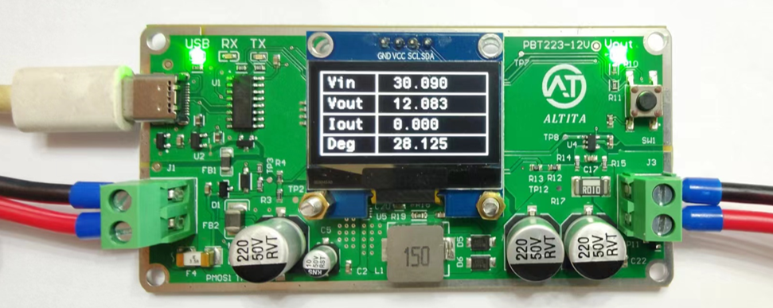
    </td>
    <td style="width: 50%;">
      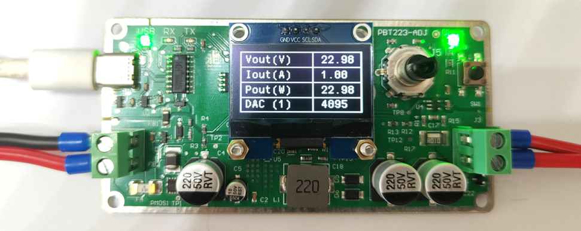
    </td>
  </tr>
</table>

<table style="width:100%; text-align:center;">
  <tr>
    <td style="width: 33%;">
      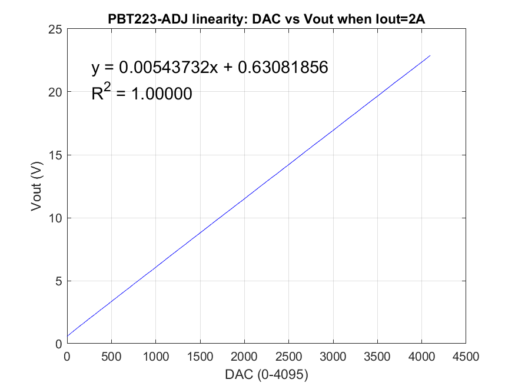
    </td>
    <td style="width: 33%;">
      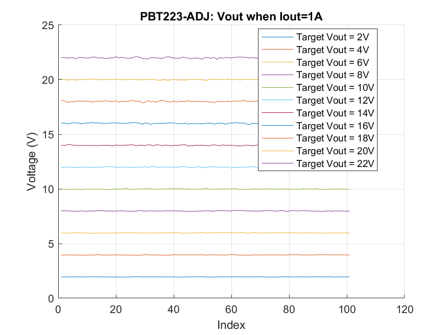
    </td>
        <td style="width: 33%;">
      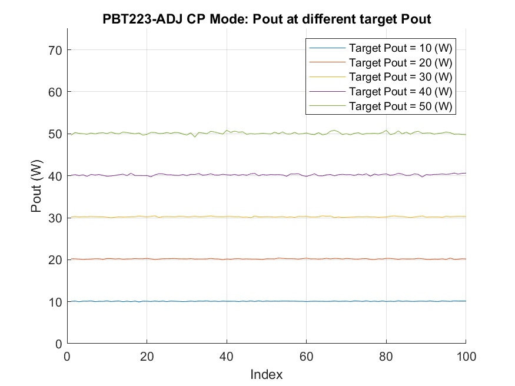
    </td>
  </tr>
</table>

## Product Selection Table
| Feature                              | PBT223-0V8 | PBT223-3V3 | PBT223-5V0 | PBT223-12V | PBT223-22V | PBT223-ADJ |
|--------------------------------------|------------|------------|------------|------------|------------|------------|
| UART Programming                     | ✅         | ✅         | ✅         | ✅         | ✅         | ✅         |
| Output Voltage Vout                  | 0.8V       | 3.3V       | 5V         | 12V        | 22V        | 1 - 22V adjustable |
| Output Current Iout                  | 0 - 3A     | 0 - 3A     | 0 - 3A     | 0 - 3A     | 0 - 3A     | 0 - 3A     |
| Input Voltage Vin                    | 2 - 30V    | 5 - 30V    | 7 - 30V    | 14 - 30V   | 24 - 30V   | Vout + 2V  |
| Output Ripple Vpp                    | &lt;150mV  | &lt;150mV  | &lt;150mV  | &lt;150mV  | &lt;150mV  | &lt;400mV  |
| Switching Frequency f_sw             | 200 - 2200kHz | 200 - 2200kHz | 200 - 2200kHz | 200 - 2200kHz | 200 - 2200kHz | 200 - 2200kHz |
| Operating Temperature                | -40 - 85 ℃ | -40 - 85 ℃ | -40 - 85 ℃ | -40 - 85 ℃ | -40 - 85 ℃ | -40 - 85 ℃ |
| Protection Circuits                  | ✅         | ✅         | ✅         | ✅         | ✅         | ✅         |
| Input/Output Reverse, OVP, OCP, OTP, UVP | ✅     | ✅         | ✅         | ✅         | ✅         | ✅         |

## Communication Protocol
### Read Commands
<table style="width:100%; text-align:center;">
  <tr>
    <td style="width: 100%;">
      
    </td>
  </tr>
</table>

### Write Commands
<table style="width:100%; text-align:center;">
  <tr>
    <td style="width: 100%;">
      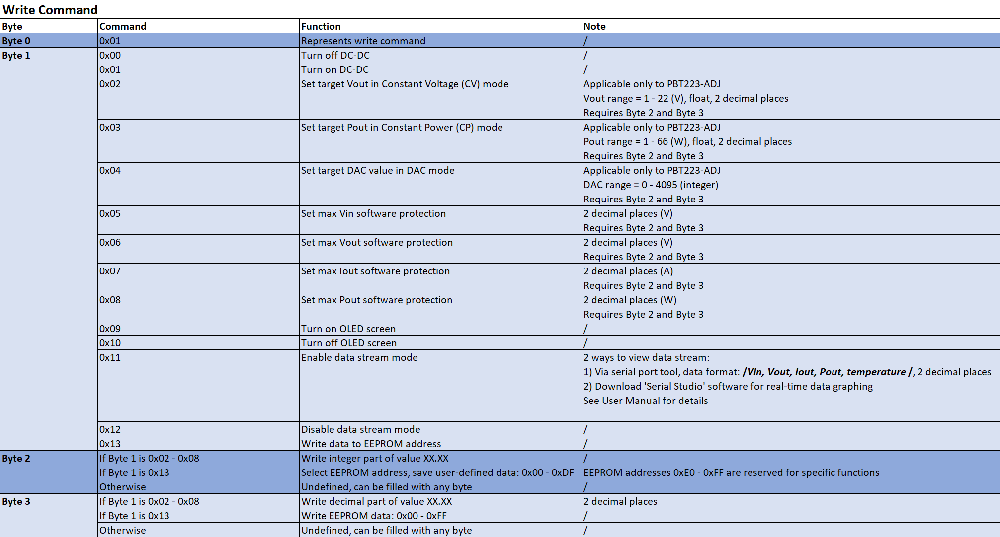
    </td>
  </tr>
</table>

### Error Information
<table style="width:100%; text-align:center;">
  <tr>
    <td style="width: 100%;">
      
    </td>
  </tr>
</table>

### EEPROM Data Mapping
<table style="width:100%; text-align:center;">
  <tr>
    <td style="width: 100%;">
      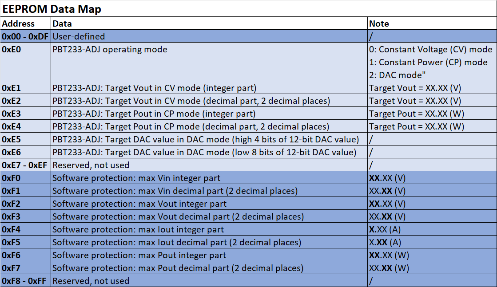
    </td>
  </tr>
</table>

## Drawings
### 2D Drawings: [Download](https://altita-tech.com/wp-content/uploads/PBT223/PBT223%202D.zip)

<table style="width:100%; text-align:center;">
  <tr>
    <td style="width: 45%;">
      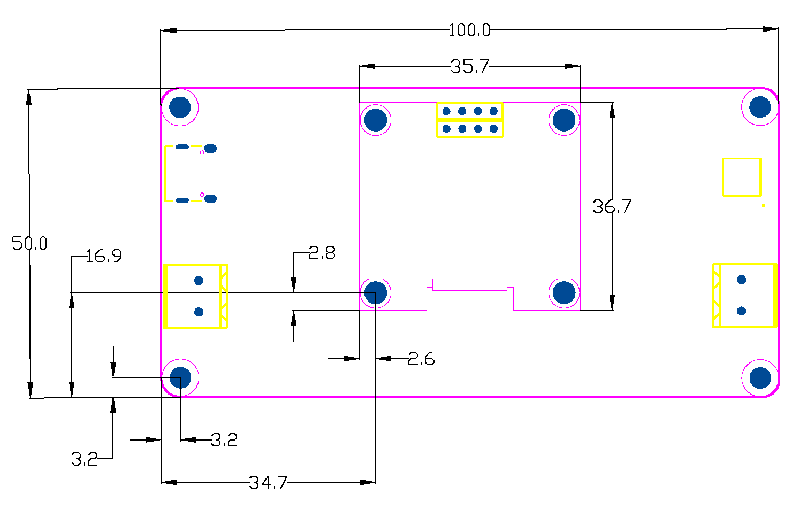
    </td>
    <td style="width: 45%;">
      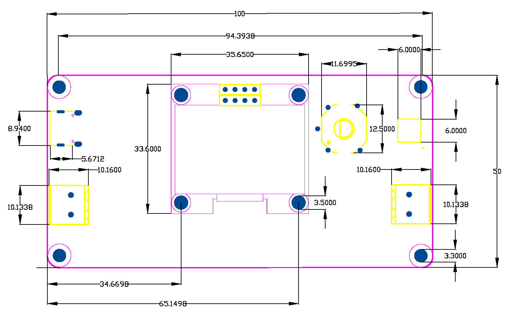
    </td>
  </tr>
</table>

### 3D Models: [Download](https://altita-tech.com/wp-content/uploads/PBT223/PBT223%203D.zip)

<table style="width:100%; text-align:center;">
  <tr>
    <td style="width: 45%;">
      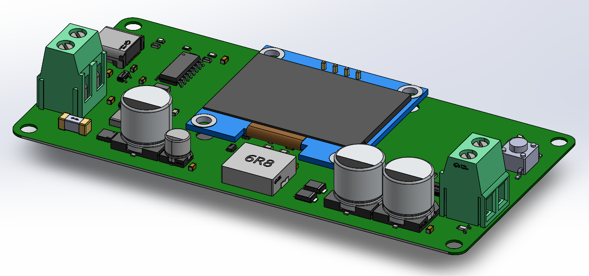
    </td>
    <td style="width: 45%;">
      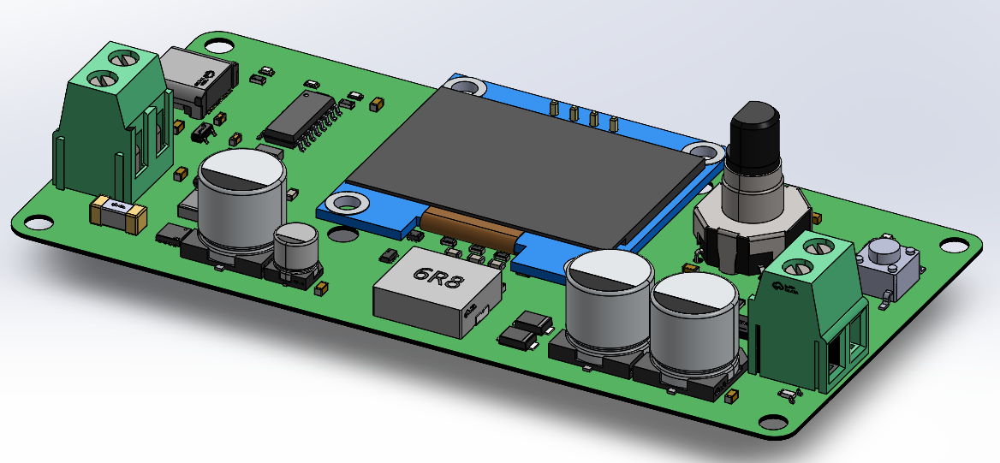
    </td>
  </tr>
  <tr>
    <td style="width: 45%;">
      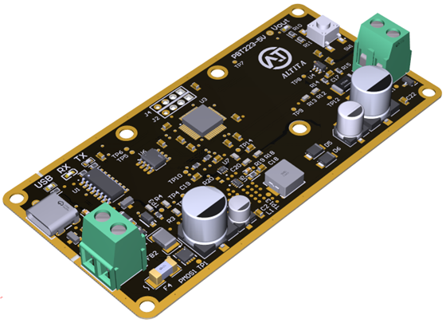
    </td>
    <td style="width: 45%;">
      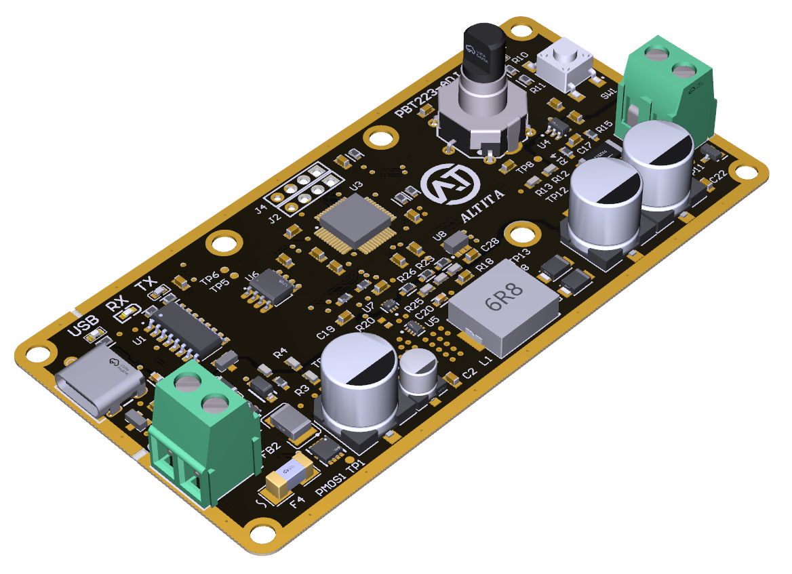
    </td>
  </tr>
</table>

## Functional Block Diagram

<table style="width:100%; text-align:center;">
  <tr>
    <td style="width: 100%;">
      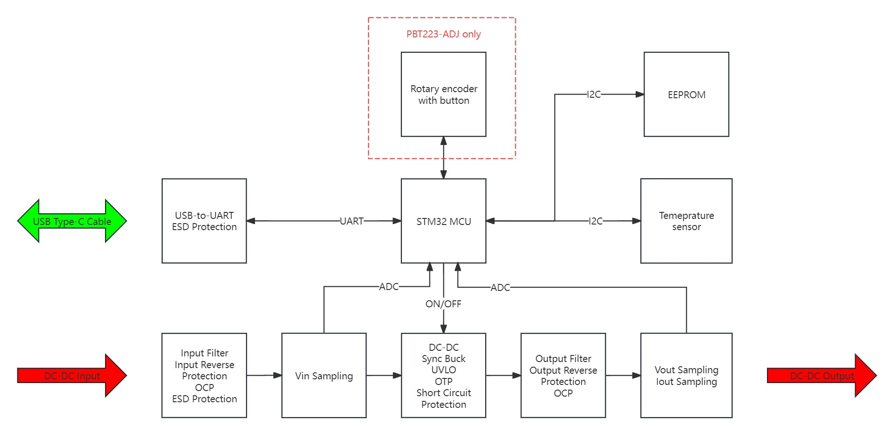
    </td>
  </tr>
</table>

## Video Tutorial

## Contact Us

  

    <ul style="list-style-type: disc; padding-left: 20px; margin: 0;">
      <li><strong>Company Website:</strong> <a href="https://altita-tech.com/">https://altita-tech.com/</a></li>
      <li><strong>Sales:</strong> <a href="mailto:sales@altita-tech.com">sales@altita-tech.com</a></li>
      <li><strong>Technical Support:</strong> <a href="mailto:tech@altita-tech.com">tech@altita-tech.com</a></li>
    </ul>
  

<table style="width:100%; text-align:center;">
  <tr>
    <td style="width: 100%;">
      
    </td>
  </tr>
</table>

